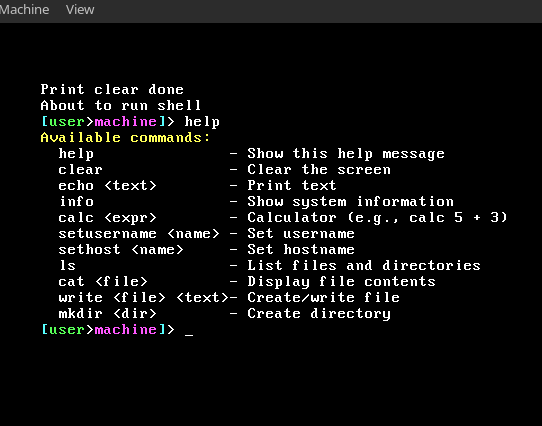

# xOS 
 small x operating system(dont ask why X because im not have a reason)



# build and test 
```
git clone https://github.com/binarylinuxx/xOS.git
cd xOS
make build-x86_64
qemu-system-x86_64 -cdrom dist/x86_64/xOS.iso # or your preffered virtual machine utility
```

# Contribution always welcomed
1. Fork the repository
2. Create a feature branch: `git checkout -b feature/amazing-feature`
3. Make your changes
4. submit video/screenshot demonstrating what you done
5. Commit your changes: `git commit -m 'Add amazing feature'`
6. Push to the branch: `git push origin feature/amazing-feature`
7. Open a pull request

# TO-DO
- trigger shift to get shifted chars
- add xfs filesystem and rename previusly named bfs while using zig/c/rust
- implement fs commands after implementing fs

# Supported commands
help               - Show this help message
clear              - Clear the screen
echo <text>        - Print text
info               - Show system information
calc <expr>        - Calculator (e.g., calc 5 - 3)
setusername <name> - Set username
sethost <name>     - Set hostname

# License
you can do wathever you want with the code and redestribute it as long as you doesnt making any personaly insulting crap and you arent corp
